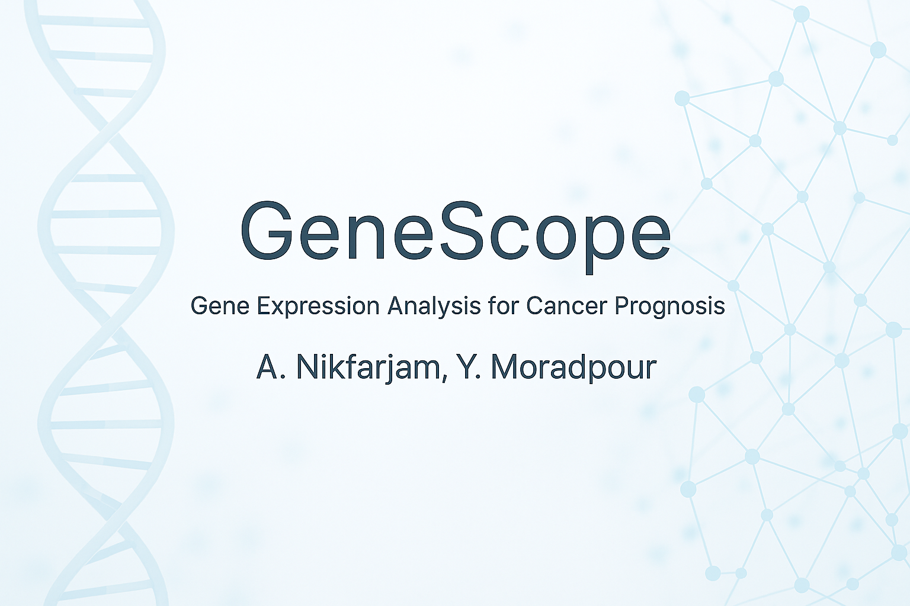

<p align="center">
  
</p>

<p align="center">
  
  
  
  
  
  
  
  
</p>

GeneScope is a research platform that combines biology, data science, and artificial intelligence to help better understand breast cancer. It analyzes patterns in gene activity and clinical information, like tumor size and patient age, to find important genes that may be linked to cancer development. Using a special method called the Analytic Hierarchy Process, GeneScope ranks thousands of genes to spotlight the ones that matter most. It also uses machine learning models to predict how likely a patient is to be diagnosed at different stages of breast cancer. By connecting genetics with clinical factors, GeneScope aims to make cancer detection earlier, smarter, and more personalized, offering new insights that could improve future treatments and patient outcomes.

## Project Structure

```
GENESCOPE
├── BackEnd/            # Flask server, APIs, models, backend logic
│   ├── Marimo_server/
|   ├── computation_anlysis/
|   ├── Docker Deployement/
│   ├── Models/
│   ├── routers/
│   └── GeneScopeServer.py
├── data/               # Gene expression and clinical datasets
├── front/              # Next.js frontend dashboard and chatbot UI
└── project_insites/    # Research notes and project documentation
```

## Feature Table


| Feature                   | Description                                                                                       |
|---------------------------|---------------------------------------------------------------------------------------------------|
| **Breast Cancer Stage Prediction** | Predicts cancer stages based on combined gene expression and clinical features.               |
| **Gene Importance Analysis**      | Identifies critical genes using a modified Analytic Hierarchy Process (AHP) and statistical methods. As well as identifying most active miRNA involved in progression of breast cancer. |
|**Cancer Prognosis Analysis**| Analyze how features such as tumore sieze, number of regional lymph nodes and dinstance that tumor have grown utilizing Cox Hazerdus Model. |
| **Interactive Chatbot**           | Conversational assistant connected to the staging model for real-time, data-backed answers.   |
| **Data Visualization**            | Dynamic charts and graphs to explore trends and findings.                                    |
| **Full-stack System**             | Backend APIs with Flask and machine learning, and a website built in Next.js.        |


## Getting Started

### Backend (Flask)

```bash
cd BackEnd
python GeneScopeServer.py
```

### Frontend (Next.js)

#### Environment Variables

Before running the project, create a `.env` file inside the `/front` directory with the following variables:

```env
NEXT_PUBLIC_FIREBASE_API_KEY=your-firebase-api-key
NEXT_PUBLIC_FIREBASE_AUTH_DOMAIN=your-firebase-auth-domain
NEXT_PUBLIC_FIREBASE_PROJECT_ID=your-firebase-project-id
NEXT_PUBLIC_FIREBASE_STORAGE_BUCKET=your-firebase-storage-bucket
NEXT_PUBLIC_FIREBASE_MESSAGING_SENDER_ID=your-firebase-messaging-sender-id
NEXT_PUBLIC_FIREBASE_APP_ID=your-firebase-app-id
NEXT_PUBLIC_FIREBASE_MEASUREMENT_ID=your-firebase-measurement-id
NEXT_PUBLIC_STUFF=your-openai-or-other-api-key
OPENAI_API_KEY=your-openai-api-key
PINECONE_API_KEY=your-pinecone-api-key
```

---

Once the `.env` file is set up, install the dependencies and run the development server:

```bash
cd front
npm install
npm run dev
```

The frontend will be available at [http://localhost:3000](http://localhost:3000).

## Technologies Used

- Frontend: Next.js, React, TailwindCSS, Chart.js, OpenAI API, langchain
- Backend: Flask, Marimo, TensorFlow/Keras, Pandas, Scikit-learn, Tensorflow Keras, lifelines.coxPHfitter, carboost.CatBoostClassifier, Docker for deploying marimo server to marimo server, GAN
- Other: Docker-ready for Google cloud deployment (App Engine)
## Analytic Files
BackEnd/computation_analysis
  
---/modAhpFunctions.py ----> This file contains all the fuctions for calculating ttest, entrhopy, wilcoxon and..
  
---/compahp.py ----> calls the functions to calculate each individual secores
  
---/compPWM ----> calculates PWM, Eigen Vectors, Eigen Values
  
---/com_fs ---> uses eigen values of each matrix(AHP ect) to compute final score

BackEnd/Models

---/DMM ----> for both experimental and Main MultiDNN

---/gbst ----> CatBoost Model utilized for calculating patients being diagnosed at any stage

BackEnd/Marimo_server/scripts ---> All the in-marimo analysis such as corrolation analysis, heatmap for comparing tope ranke genes through out different stages and even data collection and clean up

## Acknowledgements

- TCGA (The Cancer Genome Atlas) for public gene expression and clinical datasets
- Open-source libraries and research in biomedical machine learning

## Future Enhancements
- Facinating Multimodel Deep Neural Network optimized to classiffy based on gene-expressions and clinical data
- Enhanced chatbot capabilities (summarizing research papers)
- Expanded dataset support for multi-cancer analysis
- Cloud-based deployment with automated scaling

