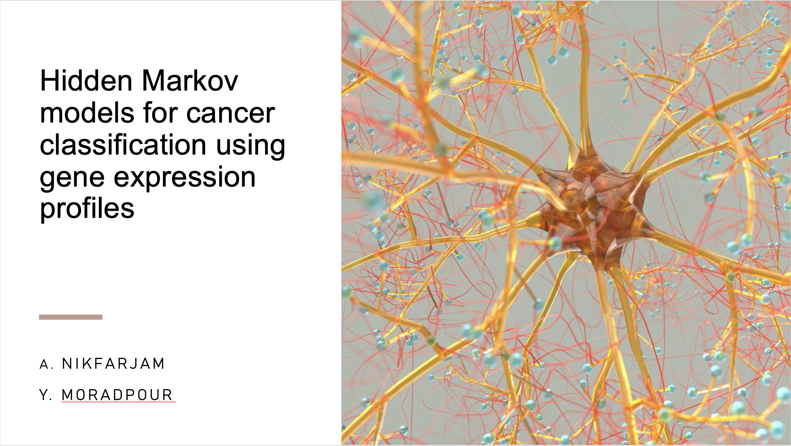
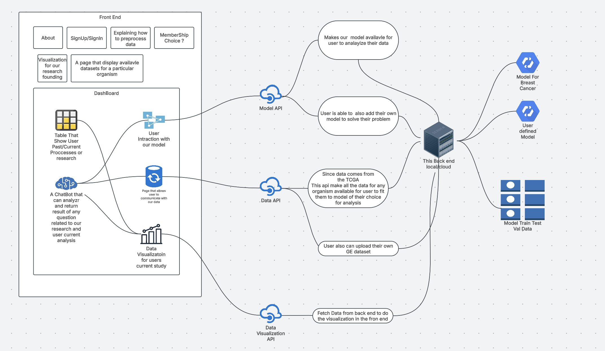
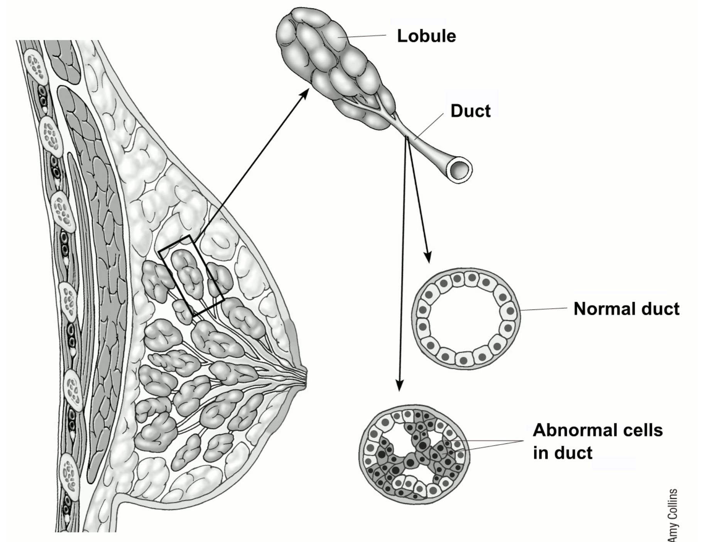
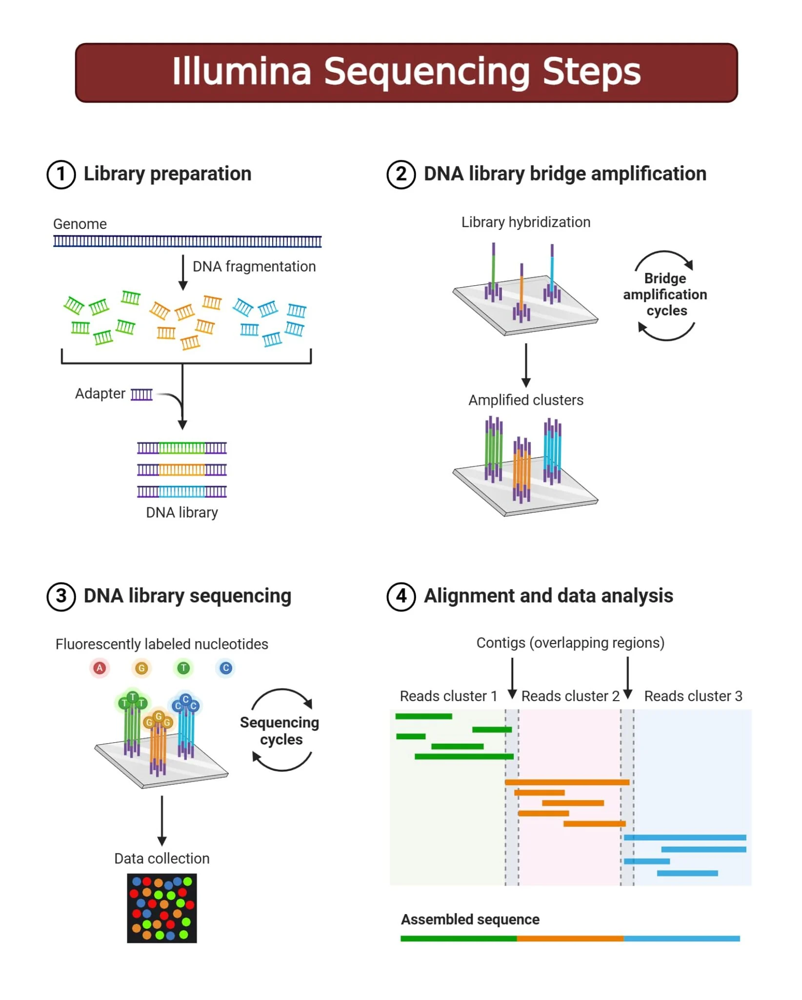

# Cancer Classification for varius breast cancer mutation using HMM

## Goal:
The purpose of this project is to use Hidden Markov model for cancer classification using gene expression profiles. The model is designed to classify different types of cancer by modeling the gene expression of each tumor type with an HMM. This method focuses on selecting the most informative utlizing AHP methods such as t-test, entropy, receiver operating characteristic curve, Wilcoxon test and signal to noise ratio. 

**Front End schema**

## Broader impact

* HMMs can help differentiate between cancer subtypes by modeling gene expression patterns.
* We can discover hidden states that correspond to different cancer progression stages or molecular subtypes
* By analyzing state transitions and performing AHP, we can identify genes that play a crucial role in cancer progression
* Genes consistently associated with high-expression hidden states can be potential biomarkers for diagnosis or prognosis.
* HMMs can reveal gene co-expression patterns and identify groups of genes that are regulated together.
* This insight helps in understanding the underlying biological mechanisms of cancer development.
* Some genes may transition between normal and cancerous expression states.
* Tracking these transitions can help identify early warning signs of cancer or predict relapse risk.

# Breast Cancer and related Genes

Breast cancer is the most frequently diagnosed cancer in women and ranked as a worldwide leading fatal illness. Cancer develops primarily from the cells that line both milk ducts and lobules that perform milk production and transportation functions. The majority of breast cancer cases occur in female patients but it does develop in males. 

Medical statistics indicate that women make up the majority of breast cancer patients in the United States where 310,720 new cases are predicted for 2024. Statistics show that breast cancer will affect 2,790 male patients during this period. Breast cancer affects men in 0.9% of total breast cancer cases while women stand at 99.1% of the total cases. The illness initially stays contained in breast tissue yet advances to penetrate neighboring tissues prior to reaching lymph nodes and distant parts of the body through bloodstream or lymphatic systems. The correct early discovery and group assignment of breast cancer remains essential because different breast cancer subtypes demand particular treatment methodologies which enhance survival outcomes.

# Comon Types of brest cancer

### situ and invasive cancer(Common Type):

* **Ductal Carcinoma In Situ (DCIS):** DCIS is a non-invasive breast cancer where abnormal cells are confined within the milk ducts and have not spread to surrounding breast tissue. While not life-threatening, DCIS can increase the risk of developing invasive breast cancer if left untreated. 

Ductal carcinoma in situ (DCIS) is linked to genetic mutations in the BRCA1 and BRCA2 genes, tumor suppressors that help repair damaged DNA. 

* **Invasive Ductal Carcinoma (IDC):** Breast cancers that have spread into surrounding breast tissue are known as invasive breast cancers.It begins in the milk ducts and invades nearby breast tissue, with the potential to spread to other parts of the body.

* **Invasive Lobular Carcinoma (ILC)** ILC starts in the milk-producing lobules and can spread to surrounding breast tissue and beyond. It is the second most common type of breast cancer.

human epidermal growth factor receptor 2 (HER2 also known as ERBB2) is related to both Invasive Ductal Carcinoma (IDC) and Invasive Lobular Carcinoma (ILC), and they are gene

In this study we are studying mutation to these 3 genes.

# Data Collection
Data has been Collected from NCBI's(The National Center for Biotechnology Information) GEO(Gene Expression Omnibus) DataSet.

This data is consist of RNA-Seq data for 9264 tumor samples and 741 normal samples across 24 cancer types from The Cancer Genome Atlas with "Rsubread".

The gene espressions are using Illumina Sequencing steps:

Steps/Process of Illumina Sequencing
1. Nucleic Acid Extraction
The first step in Illumina sequencing is isolating the genetic material from samples of interest. The extraction process is important because the quality of the nucleic acids extracted will directly affect the sequencing results. After extraction, a quality control check is usually performed to ensure the nucleic acids are pure and accurately quantified. UV spectrophotometry is typically used to check the purity, while fluorometric methods are preferred for measuring nucleic acid concentration.

2. Library Preparation
After nucleic acids are isolated, they are prepared for sequencing by creating a library which is a collection of adapter-ligated DNA fragments that can be read by the sequencer. The process starts with DNA fragmentation, where the sample is broken into smaller fragments using methods like mechanical shearing, enzymatic digestion, or transposon-based fragmentation. These fragments undergo end repair and A-tailing to prepare for the attachment of short specific DNA sequences called adapters to both ends of the fragments. These adapters contain sequences that help bind the DNA to the sequencing flow cell. They also include barcode sequences that allow multiple samples to be sequenced simultaneously and distinguished later in the analysis.

3. Cluster Generation by Bridge Amplification
The DNA library is loaded onto a flow cell containing small lanes where amplification and sequencing occurs. The DNA fragments bind to complementary primers attached to the solid surface of the flow cell and undergo bridge amplification. In bridge PCR, each DNA strand bends over to form a bridge on a chip. Forward and reverse primers on the chip help the DNA form these bridges. Each bridge is amplified, creating many clusters at each spot. The process of cluster generation finishes when each DNA spot on the chip has enough copies to produce a strong, clear signal. 

4. Sequencing by Synthesis (SBS)
Once clusters are generated, the SBS process begins. Fluorescently labeled nucleotides are added one by one to the growing DNA strand and each nucleotide emits a fluorescence as it attaches. The specific color emitted allows the system to identify the nucleotide. The sequence of each DNA fragment is determined over multiple cycles.

5. Data Analysis
Once the sequencing is completed, the sequences obtained are processed and analyzed using bioinformatics tools. Images collected from each cycle are converted into base sequences by analyzing the fluorescent signals. Bioinformatics tools clean up and organize the data, ensuring the sequences are ready for analysis. Then, the data are analyzed, aligning the sequences to a reference genome or assembling them if a reference is unavailable. This process helps identify sequence variants, map gene locations, and allow downstream analyses. Finally, the data is interpreted to analyze pathways, identify potential biomarkers, or predict gene functions. This step helps translate raw sequencing data into meaningful biological insights. Some Illumina instruments have built-in, easy-to-use analysis software that can help researchers without bioinformatics expertise.

 
 # AHP Analysis Gene Selection
 
 

## Gene Selection: Choosing the Most Important Genes
**Problem: Too Many Genes, Not All Relevant**
* A DNA microarray (gene chip) can measure the expression levels of thousands of genes at once, but not all of them are useful for classification.
* If we include all genes, the model becomes too complex and inefficient.
* The goal is to filter out irrelevant genes and identify the most informative ones.
Solution: Gene Selection Methods
* The article introduces several ranking techniques to select key genes that differentiate between cancerous and normal tissues. These techniques include:

**t-test:** Finds genes that show significant differences in expression levels between cancerous and normal cells.

**Entropy test:** – Measures disorder in gene expression; genes with high entropy provide better class separation.

**Receiver Operating Characteristic (ROC) Curve:** Selects genes with strong discriminatory power.

**Wilcoxon test:** A non-parametric test that ranks genes based on their median expression difference.
**Signal-to-Noise Ratio (SNR):** Compares differences in mean expression levels with the standard deviation.

## Modified Analytic Hierarchy Process (AHP) for Gene Selection

Traditional AHP is a decision-making method used for prioritizing factors based on expert judgment.
The authors modified AHP to integrate the rankings from the above five methods automatically.
Instead of relying on human experts, this method uses statistical rankings to create a robust and stable set of key genes for classification.

#  HMM 
HMMs are designed following a supervised learning approach so that they are capable of realizing knowledge available from cancer training data. Cancer often develops through different stages. These stages resemble the state transition of HMMs. In addition, the modularity characteristic of HMMs allows them to be combined into larger ones where each HMM is individually trained for each cancer data class. Given a new sample, trained HMMs can predict whether it is from a cancer or normal cell.